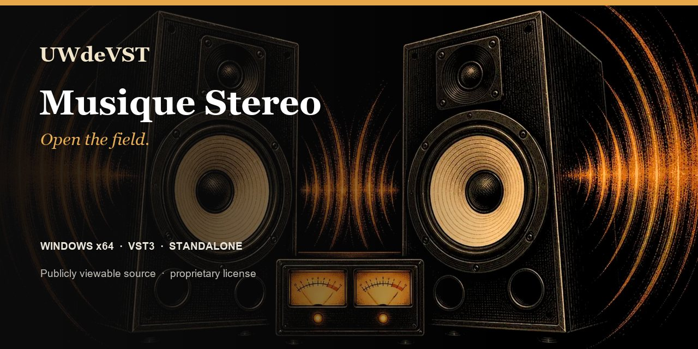

<!-- UWDEVST-SHOWCASE:START -->

  

<h1 align="center">Musique Stereo</h1>

<strong>Open the field.</strong> Widen, refocus and balance your stereo image while keeping mono under control.

  <a href="https://unicorsoundengine.com/en/plugins/fx-stereo#listen">Listen</a> ·
  <a href="https://unicorsoundengine.com/en/plugins/fx-stereo#install">Download</a> ·
  <a href="https://unicorsoundengine.com/en">Full collection</a> ·
  <a href="https://github.com/unicornwhodev/fx-stereo/issues/new/choose">Report an issue</a>

**Windows x64 · VST3 · Standalone**

- Wide, Haas, Frequency Imager and Spatial
- Mono Maker and correlation meter
- Mid/Side and Bass Mono controls

> **Publicly viewable source — proprietary license.** Official binaries are free for individuals and organizations with no more than EUR 100,000 in worldwide consolidated gross revenue. Modification and redistribution are not permitted. Professional use above that threshold requires a paid written license. [Read the license](https://unicorsoundengine.com/en/license) or [request a commercial license](https://unicorsoundengine.com/en/contact).

The license included with each tagged release governs that release. The v1.0 license applies prospectively and does not withdraw permissions already granted on earlier releases.
<!-- UWDEVST-SHOWCASE:END -->

---

# Musique Stereo

Musique Stereo is a Windows stereo-imaging effect for widening, focusing, balancing and checking stereo material while retaining practical mono controls. It is available as a Standalone application and a VST3 plug-in.

## Formats

- Windows x64 Standalone
- Windows x64 VST3

## Install a release

1. Download the Windows installer or portable ZIP from this repository's Releases page.
2. Run the installer, or extract the ZIP and copy the complete .vst3 bundle to a VST3 location scanned by your host.
3. Rescan plug-ins in the host, then insert the effect on the track or bus you want to process.

## Imaging engines

| Engine | Use |
| --- | --- |
| Wide | General width and focused stereo enhancement. |
| Haas | Micro-delay widening with timing, feedback, tone and side controls. |
| Frequency Imager | Separate low, mid and high width with crossover points. |
| Spatial | Depth, angle, air and focus shaping. |
| Mono Maker | Low-frequency mono management and mono audition. |
| Correlation | Correlation monitoring, hold, decay, zoom and warning controls. |

Width, balance, Mid Gain, Side Gain, Bass Mono, Mix and Output form the shared workflow. Use the Mono controls and correlation view when checking wider settings for compatibility.

## Factory presets

The 18 factory presets cover mix-bus widening, vocal focus, pad expansion, overheads, bass mono control, Haas effects, frequency imaging, spatial shaping, mono-maker settings and correlation checks.

## Build from source

Requirements: Windows x64, PowerShell, Git, CMake 3.22 or later, Visual Studio 2022 (or Build Tools) with Desktop development with C++, and JUCE 8.0.4.

~~~powershell
.\_build_all.ps1 -Configuration Release -BootstrapJuce
~~~

To use an existing JUCE 8.0.4 checkout:

~~~powershell
.\_build_all.ps1 -Configuration Release -JuceDir C:\Dev\JUCE
~~~

The build produces Standalone and VST3 artefacts.

## Package a local build

~~~powershell
.\_package_release.ps1 -Configuration Release -BootstrapJuce
~~~

The script creates a portable Windows package and, when Inno Setup 6 is installed, a Windows installer. Use the SkipInstaller option when an installer is not required.

## Repository contents

| Path | Purpose |
| --- | --- |
| Source/ | Plug-in source, effect engines and visual assets |
| Presets/ | Factory preset bank |
| FXShared/ | Local shared UI and audio helpers required by this plug-in |
| installer/ | Windows installer definition |

## Licence and support

The source code is publicly viewable under a proprietary license. Viewing and private compilation of strictly unchanged source are permitted; modification and redistribution are not. See [LICENSE.md](LICENSE.md). For a released-build issue, open an issue with the Windows version, host name/version, plug-in format and steps to reproduce it.
